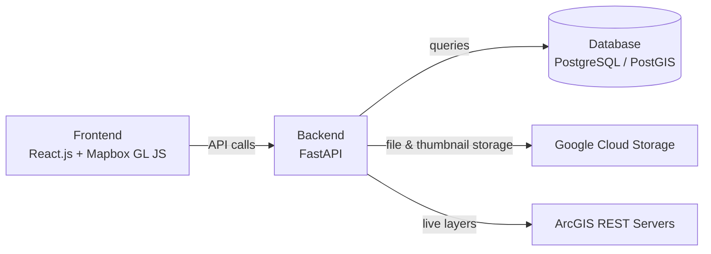

# Living Atlas — App Overview and About

## What is the CEREO Living Atlas?

The CEREO Living Atlas is a web-based, map-focused platform for gathering, viewing, and sharing environmental data relevant to the Pacific Northwest, with a particular focus on water quality in the Columbia River Basin. It was built in collaboration with the **Center for Environmental Research, Education, and Outreach (CEREO)** at Washington State University.

The platform gives users a single interactive interface to upload and explore geospatial information — from tracking water quality to monitoring restoration work and community engagement. Instead of leaving environmental datasets fragmented across separate systems, the Living Atlas brings them together into one public-facing, visual interface.

---

## Who is it for?

The Living Atlas is designed for a broad community of users:

- **Researchers** working with or alongside CEREO who want to share and discover data.
- **Tribal communities** monitoring local ecosystems and identifying environmental concerns.
- **Educators and students** exploring environmental data in an accessible way.
- **Government agencies** that benefit from easily accessible datasets to guide environmental investment and decisions.

A core design goal is to stay user-friendly for people without a technical background while remaining robust enough for academic and policy work.

---

## The Core Concept: Cards

The fundamental data unit of the Living Atlas is a **card**. Each card represents a geographically located resource — such as a water quality monitoring station, a watershed research area, or an environmental dataset.

A card can include:
- A title, category, and description
- Metadata (organization, funding, tags, external links)
- File attachments and an image gallery
- A location shown on the map as a **point marker**, a **polygon area**, or an **image overlay**

Cards are searchable and filterable by category, tag, or keyword, giving users an intuitive, visual way to navigate complex datasets. (For details on creating cards, see the Create Card feature documentation.)

---

## What Can Users Do?

| Capability | Available to |
|------------|--------------|
| View map data and search/filter cards | Any user (no login required) |
| Bookmark (favorite) cards | Any logged-in user |
| Reset password | Any registered user |
| Create, edit, and delete cards | Authorized users (own cards); admins (any card) |
| Load / remove ArcGIS spatial layers on the map | Any user |
| View layer and service information modals | Any user |
| Toggle ArcGIS data by state (WA, ID, OR) | Any user |
| Manage ArcGIS services (rename, remove, restore, update) | Administrators |
| Manage user accounts and access levels | Administrators |

---

## User Roles (Role-Based Access Control)

The application uses a role-based access control (RBAC) model:

- **Any user** — Can browse map data, load ArcGIS layers, and use search functionality without an account.
- **Registered user** — Has created an account and can log in and bookmark cards.
- **Authorized user** — Has permission to add cards and later view, edit, or remove their own cards.
- **Administrator** — Can grant authorization, edit or remove any card, and manage user accounts.

---

## Key Features at a Glance

### Interactive Map
- Built on **Mapbox GL JS**, with geospatial data rendered in real time.
- Cards appear as points, polygons, or image overlays.
- Clicking a card centers the map on its location.

### Card Management
- Create cards with rich metadata, file attachments, and image galleries.
- Edit and delete cards (creators and admins).
- "Learn More" modal shows full card details.

### Bookmarks / Favorites
- Logged-in users can bookmark cards via the bookmark icon.
- A "Show Favorites Only" filter displays just bookmarked cards.

### Search, Sort, and Filter
- Keyword search across cards.
- Sort by criteria such as nearest to current location or most recently added.
- Filter by category and tags.

### ArcGIS Spatial Data
- Loads toggleable raster layers and metadata from the **ArcGIS REST** servers of Washington, Idaho, and Oregon.
- Folder → service → layer structure in the upload panel.
- Loaded layers appear as clickable colored regions, lines, or points with info pop-up modals.
- Admins can rename, remove (recycle bin), restore, permanently delete, and synchronize services with the ArcGIS server.

### Accounts and Authentication
- User registration (requests approved by an admin), login, and password reset (one-time email verification link).
- Admin dashboard for managing registered users and access levels.

### Chatbot Helper
- A floating chatbot widget on the home page (under development). See the Chatbot Widget documentation for details.

---

## Architecture

The Living Atlas uses a **three-layer architecture**: frontend, backend, and database. The modular design lets each component be updated independently.

### Frontend Subsystem
- **React.js** single-page application handling user interaction and rendering geospatial data.
- Uses **Mapbox GL JS** (and Leaflet.js) for interactive maps, markers, and drawing.
- Communicates with the backend through API calls.

### Backend Subsystem
- **FastAPI** (Python) acts as the core intermediary.
- Manages authentication, role-based access, data validation, and geospatial API endpoints.
- Bridges the frontend, the database, Google Cloud Storage, and ArcGIS REST services.

### Database Subsystem
- **PostgreSQL** with the **PostGIS** extension for efficient spatial queries and indexing.
- Stores geospatial card data, user credentials/authentication records, and metadata.
- (Deployment note: card, user, and metadata storage is hosted on a Microsoft Azure database.)

---

## Technology Stack

| Layer / Purpose | Technology |
|-----------------|------------|
| Frontend UI | React.js, Bootstrap / CSS, HTML5 |
| Mapping | Mapbox GL JS, Leaflet.js |
| Backend API | FastAPI (Python) |
| Database | PostgreSQL + PostGIS (hosted on Microsoft Azure) |
| File / thumbnail storage | Google Cloud Storage |
| Frontend hosting | Netlify |
| Backend hosting | Render |
| Spatial data source | ArcGIS REST servers (WA, ID, OR) |
| Version control | Git / GitHub |

---

## Standards Used

- **GeoJSON (RFC 7946)** — Standard encoding for points, lines, and polygons.
- **OpenAPI Specification (OAS 3.0)** — FastAPI auto-generates API docs at `/docs` and `/openapi.json`.
- **JSON Schema (Draft 2020-12)** — Request/response validation via FastAPI and Pydantic.
- **Dublin Core Metadata Standard (ISO 15836)** — Candidate standard for describing card metadata.

---

## Data Model (High Level)

The system centers on two major data structures:

1. **Geospatial data (cards)** — Spatial geometry plus card information: title, description, category, tags, organization, funding, external links, attached files, images, and the creating user.
2. **User accounts** — User ID, username, email, encrypted password, and authorization level (view-only, authorized to add data, or admin).

---

## Running the App Locally

Prerequisites: **Python 3**, **Node.js**, and **npm**.

1. Create and activate a Python virtual environment, then install backend packages from `requirements.txt`.
2. **Frontend** — In the `LivingAtlas1/client` folder, run `npm start`.
3. **Backend** — In the `LivingAtlas1/backend` folder, run `uvicorn main:app --reload`.

Rebuilding from scratch additionally requires Google Cloud service account credentials, the PostgreSQL database schema, and the Netlify/Render deployment configuration.

---

## Frequently Asked Questions

**Q: What is the Living Atlas in one sentence?**
A: It is a map-based web platform for uploading, exploring, and sharing environmental geospatial data for the Pacific Northwest, focused on water quality in the Columbia River Basin.

**Q: Do I need an account to use it?**
A: No. Anyone can view the map, load ArcGIS layers, and search cards. An account is required to bookmark cards, and authorization is required to add or edit cards.

**Q: What is a "card"?**
A: A card is the core data unit — a geographically located resource shown on the map as a point, polygon, or image overlay, with metadata, files, and images attached.

**Q: Who can add or edit data?**
A: Authorized users can add cards and manage the ones they created. Administrators can edit or delete any card and manage user accounts.

**Q: Where does the spatial layer data come from?**
A: Toggleable ArcGIS layers are fetched live from the ArcGIS REST servers for Washington, Idaho, and Oregon.

**Q: What technologies power the app?**
A: A React.js frontend (hosted on Netlify), a FastAPI backend (hosted on Render), and a PostgreSQL/PostGIS database (hosted on Azure), with Google Cloud Storage for file and image storage, and Mapbox GL JS for mapping.

**Q: Why does map data sometimes load slowly?**
A: Raster ArcGIS layers are rendered as colored regions and can take time to appear, especially with dense data. Performance optimization and caching are known areas of future work.

**Q: Is the platform mobile-friendly?**
A: It functions on mobile browsers, though a more responsive layout and a dedicated mobile experience are identified as future improvements.

---

## Glossary (Quick Reference)

| Term | Meaning |
|------|---------|
| Card | The core geolocated data unit of the Living Atlas |
| GeoJSON | JSON-based format for encoding geographic data |
| PostGIS | Spatial extension for PostgreSQL enabling geospatial queries |
| RBAC | Role-Based Access Control — restricts actions by user role |
| ArcGIS REST | The web service used to fetch toggleable spatial layers |
| Columbia River Basin | The watershed region that is the primary focus of the Atlas |
| CEREO | Center for Environmental Research, Education, and Outreach (WSU) |
